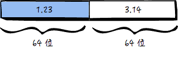
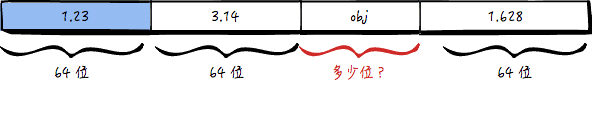
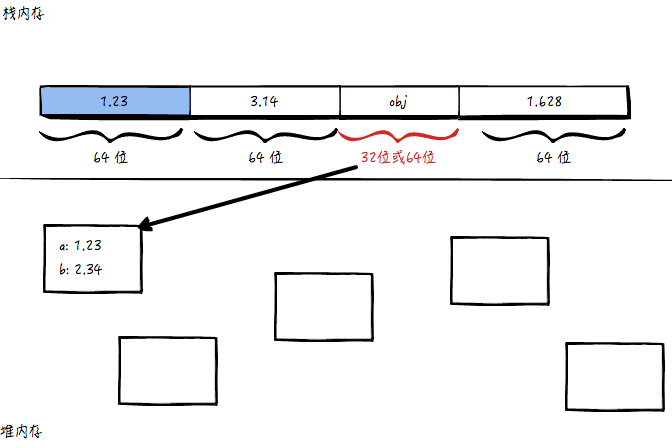
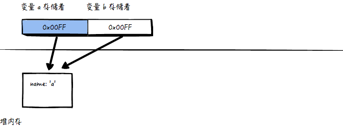

## JS 里基本类型（值）和复杂类型（引用）有什么区别？

_短答案_

1. 基本类型变量存的是值，复杂类型的变量存的是内存地址。

2. 基本类型在赋值的时候拷贝值，复杂类型在赋值的时候只拷贝地址，不拷贝值。

_长答案_

计算机要存储一个整数，它可以用 32 个位（bit）来存储，一个小数，可以用 64 位来存储。但不管怎样，位数都是固定的。

例如：

```
var a = 1.23
var b = 3.14
```

对应的内存是这样：



接下来加几行代码：

```
var obj = {}
var c = 1.628
```

现在，计算机遇到一个难题，到底用多少位来存 obj 呢？



用固定位数有一个问题，如果程序员之后往 obj 上添加属性（如 obj.a = 1.23; obj.b = 2.34），那么 obj 用的位数可能放不下这两个小数。

有人说，「那给 obj 分配足够多的位数不就好了，比如一万位，总够用吧？」不行，这样做一来浪费内存，二来一万位也不一定够用，万一 obj 里面的属性非常多呢？

**引入另一种内存**

为了解决 obj 存储的问题，计算机将程序里的内存分成两种，一种是上图所示，按顺序使用用内，每个数据占据的位数是固定的，这种内存叫做「栈内存」；另一个，就是专门用来存储位数不固定的数据，存的时候不一样按顺序一个一个存，这种内存叫做「堆内存」。

我们来看 obj 应该怎么存储：



如图， obj 在栈内存那里，只占固定位数（32 位或 64 位或其他都可以），里面存的并不是数据{a:1.23,b:2.34}，里面存的是数据「在内存中的位置」（类似于引用或者指针）。
堆内存里，会开辟一块空间来存放 {a:1.23, b:2.34}。

「如果我再给 obj 添加一个属性怎么办呢？obj.c = 3.45」
那么 obj.c 依旧会放到堆内存，同时占用的内存空间也会动态的变化，以盛放 obj.a、obj.b 和 obj.c 三个小数。具体怎么动态变化，则是由 JS 引擎来负责的。

**值 V.S. 引用**

如果变量存储的是原始值，那么这个变量就是值类型，在 JS 里也叫做基本类型。

如果变量存储的是内存位置，那么这个变量就是引用类型，在 JS 里也叫复杂类型，也就是对象。

值类型在赋值的时候是直接拷贝的，而引用类型则只拷贝地址。

值类型的赋值举例：

```
var a = 1.23
var b = a
```

对应的内存结果为：


引用类型的赋值举例：

```
var a = {name: 'a'}
var b = a
```

对应内存结果为：



也就是说，a 和 b 都存储着「同一块内存」的地址！那么就会有一个问题：

当我们修改 b.name 的时候，a.name 也会跟着变：

```
b.name = 'b'
a.name === 'b' // true
```
