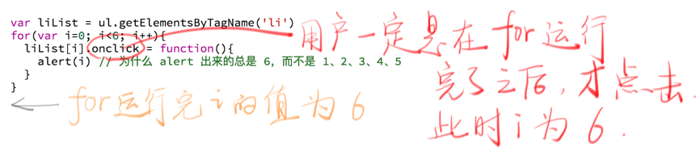

## 立即执行函数是什么

立即执行函数就是:

1. 声明一个匿名函数
2. 马上调用这个匿名函数

```
(function() { console.log('匿名函数') })();
```

上面是一个典型的立即执行函数。

- 首先声明一个匿名函数 function(){console.log('匿名函数')}。
- 然后在匿名函数后面接一对括号 ()，调用这个匿名函数。

_那么为什么还要用另一对括号把匿名函数包起来呢？_

其实是为了兼容 JS 的语法。

如果我们不加另一对括号，直接写成

```
function(){console.log('匿名函数')}()
```

浏览器会报语法错误。想要通过浏览器的语法检查，必须加点小东西，比如下面几种

```
(function(){console.log('匿名函数')} ()) // 用括号把整个表达式包起来
(function(){console.log('匿名函数')}) () //用括号把函数包起来
!function(){console.log('匿名函数')}() // 求反，我们不在意值是多少，只想通过语法检查。
+function(){console.log('匿名函数')}()
-function(){console.log('匿名函数')}()
~function(){console.log('匿名函数')}()
void function(){console.log('匿名函数')}()
new function(){console.log('匿名函数')}()
```

## 立即执行函数有什么用

只有一个作用：创建一个独立的作用域。

这个作用域里面的变量，外面访问不到（即避免「变量污染」）。

例：

```
var liList = ul.getElementsByTagName('li')
for(var i=0; i<6; i++){
  liList[i].onclick = function(){
    alert(i) // 为什么 alert 出来的总是 6，而不是 0、1、2、3、4、5
  }
}
```

为什么 alert 的总是 6 呢，因为 i 是贯穿整个作用域的，而不是给每个 li 分配了一个 i，如下：



那么怎么解决这个问题呢？用立即执行函数给每个 li 创造一个独立作用域即可（当然还有其他办法）：

```
var liList = ul.getElementsByTagName('li')
for(var i=0; i<6; i++){
  !function(ii){
    liList[ii].onclick = function(){
      alert(ii) // 0、1、2、3、4、5
    }
  }(i)
}
```

在立即执行函数执行的时候，i 的值被赋值给 ii，此后 ii 的值一直不变。

i 的值从 0 变化到 5，对应 6 个立即执行函数，这 6 个立即执行函数里面的 ii 「分别」是 0、1、2、3、4、5。
